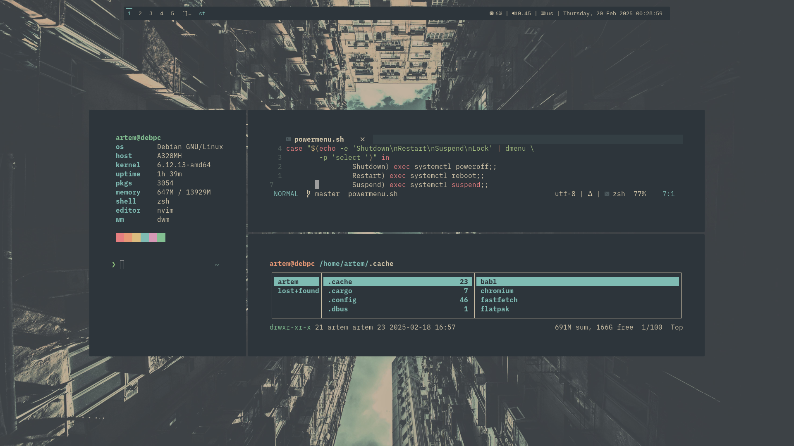
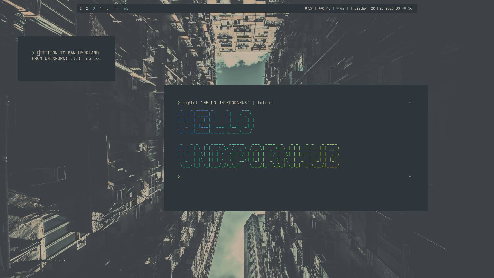
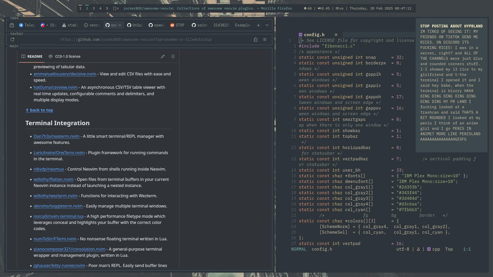
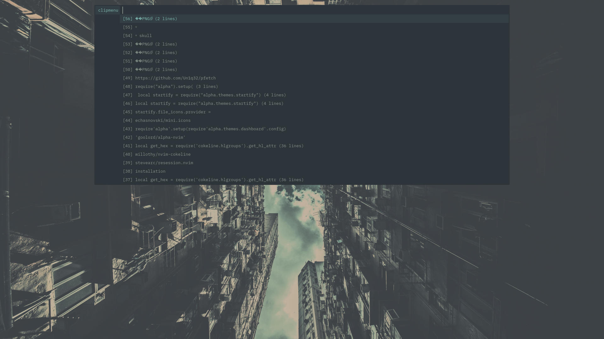
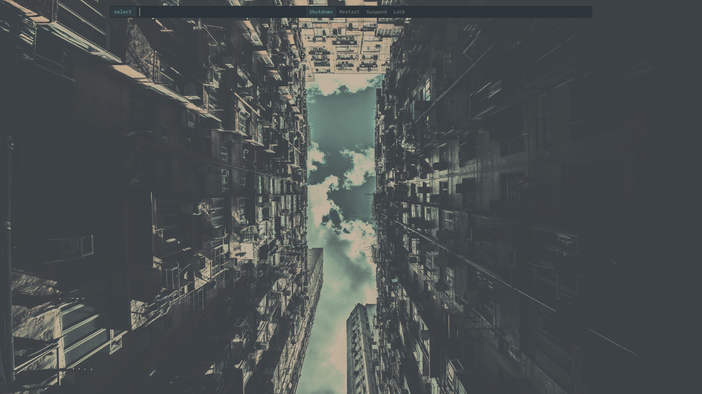
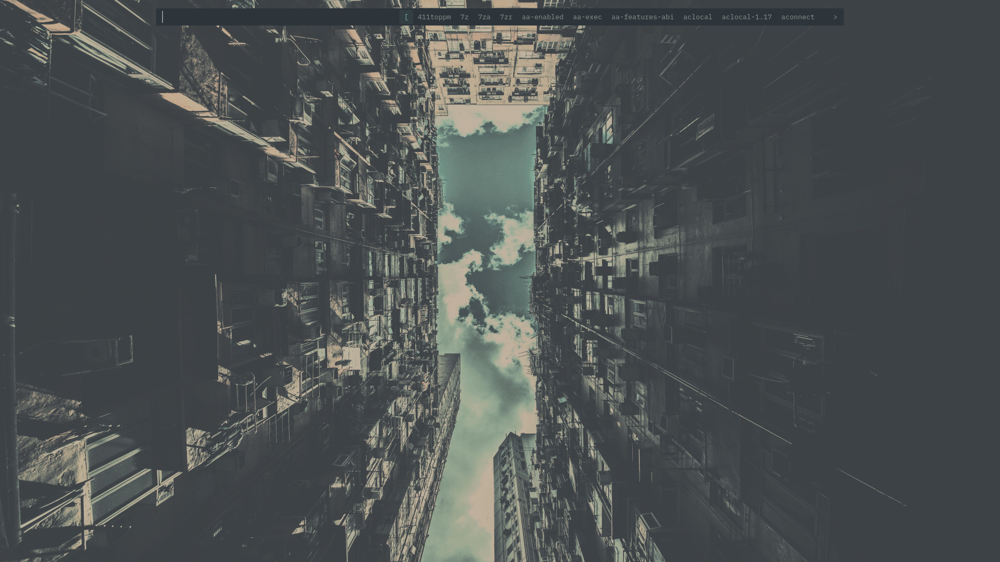

# 
yet another dwm rice
## quick description
My first proper dwm rice with patches and my first try to use another colorscheme (instead of gruvbox)
## preview

## fonts
* Font Awesome 6
* IBM Plex Mono / BlexMono Nerd Font
## more info
### wallpaper
[here you go](./not-so-eforest-city.jpg)

Actually it's [this one](./not-so-gruv-city.jpg) but in everforest colors (made with [gowall](https://github.com/Achno/gowall))
### dwm
#### patches
* actualfullscreen
* autostart
* bar-height
* barpadding
* resizecorners
* statuspadding
#### status monitor
* slstatus
### st
#### patches
* anysize
* blinking-cursor
* bold-is-not-bright
* boxdraw
* scrollback (+ scrollback-mouse)
### dmenu
#### patches
* bar-height
* caseinsensitive
* xyw
#### scripts
* powermenu
* [clipmenu](https://github.com/cdown/clipmenu)
* emoji menu *(private WIP for now)*
### other tools
* slock
* *(soon)* surf
